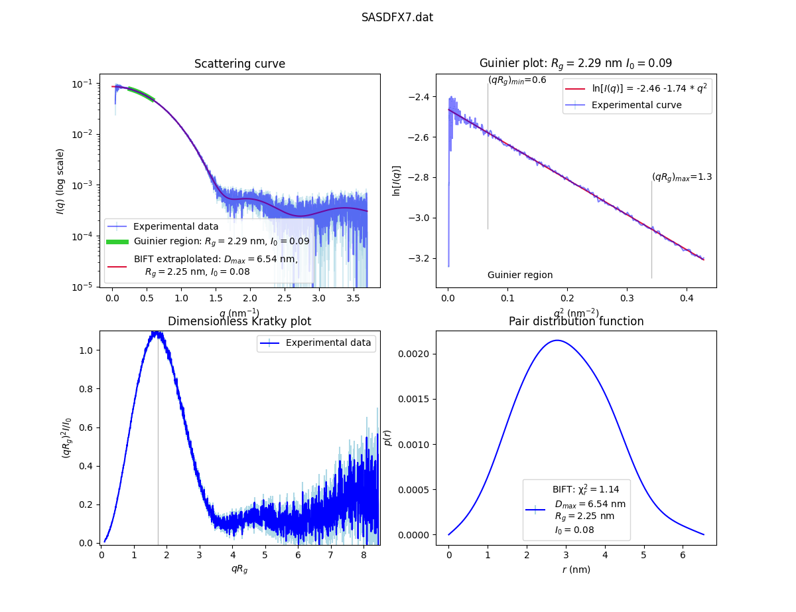

Quick Analysis
==============

FreeSAS provides also a few useful tools to display and manipulate SAS data.
The `freesas` program is performing Guinier, Kratky and BIFT and displays 
a graphic which should allow the visual data quality assessement. 

